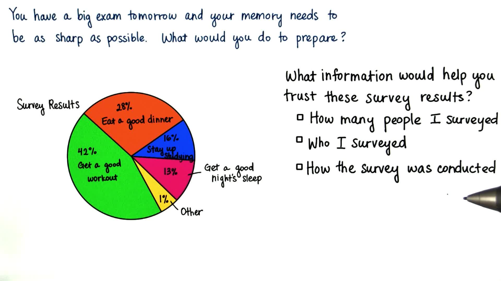
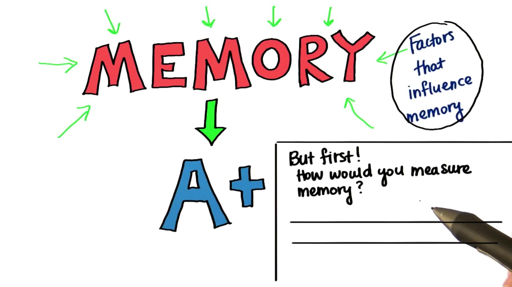

# INTRO TO RESEARCH METHODS

## Believe Results

**All the options are correct**
*for any information to be validated we must know*

- whether it is of good sample size.
- a representative sample
- sound methodology of survey

## Measure Memory

**We Will consider all the factors that influence memory**

## DEFINE CONSTRUCTS
